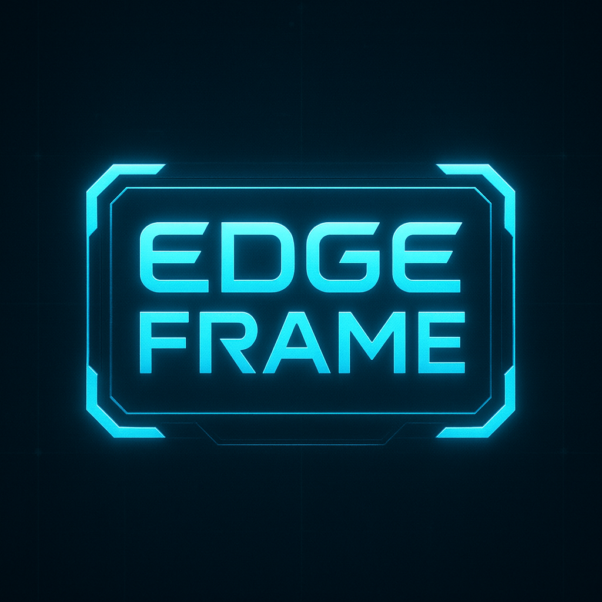
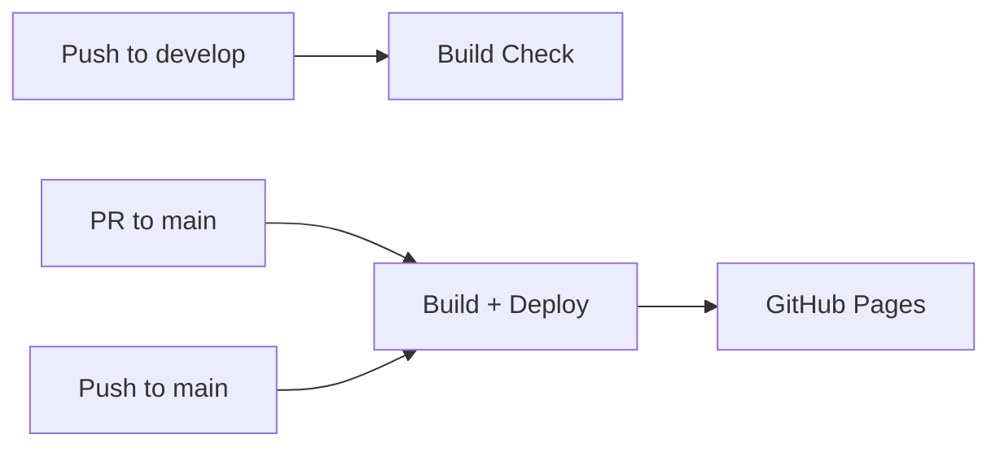

# 🎬 EdgeFRAME - AI-Powered Anime Video Upscaling

<div align="center">



**Transform your anime videos with cutting-edge AI upscaling technology**

[](https://github.com/DiegoPrietoG/edgeFRAME-frontend/actions)
[](https://opensource.org/licenses/MIT)
[](https://www.typescriptlang.org/)
[](https://vitejs.dev/)

</div>

---

## 🌟 ¿Qué es EdgeFRAME?

EdgeFRAME es una aplicación web moderna que permite a los usuarios subir videos de anime y aplicar técnicas de **upscaling con inteligencia artificial** para mejorar significativamente la calidad visual. Perfecto para restaurar anime clásico o mejorar videos de baja resolución.

## 🛠️ Tecnologías Utilizadas

<div align="center">

| Frontend | Build & Deploy | Desarrollo |
|----------|----------------|------------|
|  |  |  |
|  |  |  |
|  |  |  |

</div>

## 📦 Instalación y Configuración

### Prerrequisitos

- **Node.js** (versión 18 o superior)
- **npm** o **yarn**
- **Git**

### 🔧 Instalación Local

```bash
# 1. Clonar el repositorio
git clone https://github.com/DiegoPrietoG/edgeFRAME-frontend.git
cd edgeFRAME-frontend

# 2. Instalar dependencias
npm install

# 3. Ejecutar en modo desarrollo
npm run dev

# 4. Abrir en el navegador
# La aplicación estará disponible en http://localhost:5173
```

### 🏗️ Build para Producción

```bash
# Generar build optimizado
npm run build

# Preview del build
npm run preview
```

## 🎯 Cómo Usar EdgeFRAME

1. **📁 Sube tu Video**: Arrastra y suelta o selecciona un archivo de video anime
2. **⚙️ Configura Opciones**: Selecciona la resolución objetivo y parámetros de upscaling
3. **� Procesa**: Deja que la IA trabaje su magia
4. **� Descarga**: Obtén tu video mejorado en alta calidad

## 🌊 Flujo de Trabajo de Desarrollo

Este proyecto utiliza **GitFlow** para el manejo de ramas:

- `main` → Producción (auto-deploy a GitHub Pages)
- `develop` → Desarrollo (build check automático)
- `feat/*` → Nuevas funcionalidades

### 🔄 CI/CD Pipeline



## 📄 Licencia

Este proyecto está bajo la Licencia MIT. Consulta el archivo [LICENSE](LICENSE) para más detalles.

## 👥 Equipo

- **[Diego Prieto](https://github.com/DiegoPrietoG)** - Desarrollador
- **[Juan Rodríguez](https://github.com/juanrguezsu7)** - Desarrollador

## ⭐ Añadir una feature a `develop`
1. Situarse en la rama `develop`
2. Crear una rama de feature: `git flow feature/bugfix start nombre-feature` (donde `nombre-feature` es un nombre descriptivo de la feature, por ejemplo `nueva-pagina-inicio`)
3. Hacer commits de los cambios siguiendo el prefijo `feat: ` o `fix: ` según corresponda
4. Publicar la feature: `git flow feature/bugfix publish nombre-feature`
5. Abrir un Pull Request en GitHub desde la rama de feature a `develop`
6. Una vez aprobado el PR, hacer checkout a `develop`, hacer pull para actualizar, y borrar la rama de feature de forma local y remota

## 🌲 Cómo hacer el CI/CD con GitHub Actions y GitFlow
1. Situarse en la rama `main` y hacer pull para actualizar (hacer lo mismo en `develop`)
2. **Comprobar que todo funciona correctamente en la rama `develop` (build check automático)**
3. Situarse en la rama `develop`
4. Crear una rama de release: `git flow release start x.x.x` (donde `x.x.x` es la versión, por ejemplo `0.1.0`) **IMPORTANTE**: Usar un tag nuevo cada vez, no repetir tags
5. Hacer commits de cambios de última hora (opcional)
6. Finalizar la release: `git flow release finish x.x.x`
- Añadir un texto para el commit de la release (opcional)
- Añadir un tag para la tag de la release (**obligatorio**)
7. Subir los cambios a GitHub: `git push origin main develop --tags`

---

<div align="center">

**⭐ Si te gusta EdgeFRAME, ¡dale una estrella en GitHub! ⭐**

Hecho con ❤️ y mucho ☕ por el equipo de EdgeFRAME

</div>
